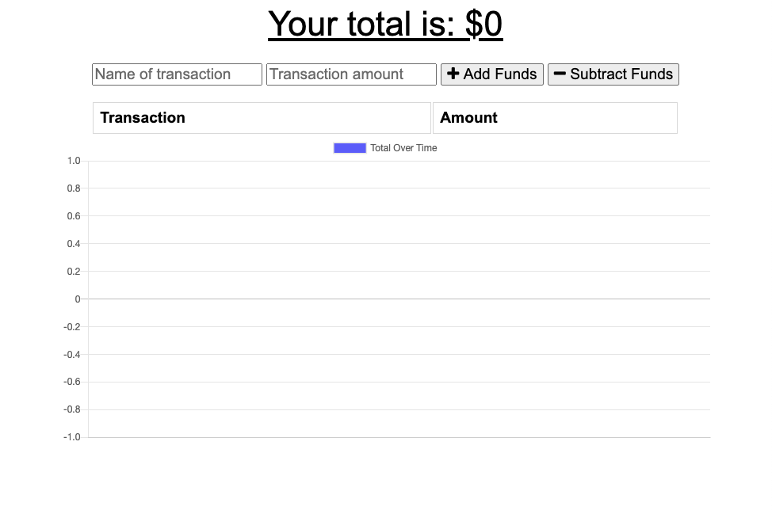

# PWA BUDGET TRACKER

## Table of Contents
* Description
* User Story
* Production Team
* How to Use
* Demo Link
* Screenshot
* Technology
* Sources
* Additional Questions   

## Description 
Add functionality to our existing Budget Tracker application to allow for offline access and functionality.
The user will be able to add expenses and deposits to their budget with or without a connection. When entering transactions offline, they should populate the total when brought back online.

Offline Functionality:

  * Enter deposits offline
  * Enter expenses offline

When brought back online:

  * Offline entries should be added to tracker.

## User Story

* As an avid traveller I want to be able to track my withdrawals and deposits with or without a data/internet connection so that my account balance is accurate when I am traveling.

## Production Team
* [Alex Eesley ](https://github.com/aeesley)

## How to Use
Use the budget app on or offline to input withdrawals or deposits which will then be shown on the page and added back to the transaction history when the connection is back online.

## Demo Links 
[Heroku](https://pwa-budget-tracker-eesley.herokuapp.com/)
[Github](https://github.com/aeesley/pwa-budget-tracker)

## Screenshot

## Technology
Mongo, Mongoose, Github, Node, JQuery, Express, Atlas, Heroku, HTML, CSS etc.

## Sources
Worked through this project using past class activities and help from a tutor session.

## Additional Questions
If you have any questions about the project, please reach out through GitHub.
